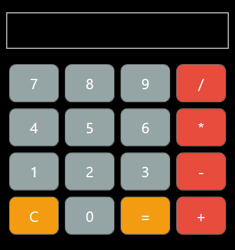
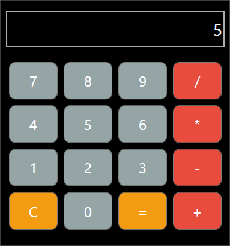

# Calculadora

## Descripció

Aquest projecte és una calculadora bàsica desenvolupada en WPF (Windows Presentation Foundation) que permet realitzar operacions matemàtiques senzilles com sumes, restes, multiplicacions i divisions. La calculadora gestiona també operacions encadenades, mostrant resultats en temps real, i inclou un botó per esborrar l'última operació o reiniciar la calculadora.

La calculadora està dissenyada per ser intuïtiva i fàcil d'usar, amb un disseny senzill i colors distintius per als botons d'operació i especials.

## Característiques

- **Operacions bàsiques:** +, -, *, /
- **Resultats en temps real:** Els resultats es mostren immediatament després de prémer el botó "=".
- **Gestió d'errors:** Manejament de casos d'errors com operacions incorrectes (p. ex., "5 + =") i divisió per zero.
- **Interfície intuïtiva:** Botons arrodonits i colors fàcils de distingir per als operadors i botons especials.

## Requisits

Per executar aquesta aplicació, necessites tenir instal·lat el següent:
- Visual Studio amb suport per al desenvolupament en **C#** i **WPF**.
- .NET Framework 4.7.2 o superior.

## Com executar el projecte

1. **Clona el repositori:**

    ```bash
    git clone https://github.com/JoelMargenet/Calculadora.git
    ```

2. **Obre el projecte a Visual Studio.**
   - Obre `Calculadora.sln` al directori del projecte clonado.

3. **Construeix i executa l'aplicació:**
   - A Visual Studio, fes clic a "Start" per compilar i executar el projecte.

## Ús

1. **Introduir números:** Prem els botons numèrics per afegir números a l'operació.
2. **Afegir operadors:** Prem els botons d'operació (p. ex., `+`, `-`, `*`, `/`) per afegir operadors a l'operació.
3. **Mostrar el resultat:** Prem el botó "=" per calcular el resultat de l'operació actual.
4. **Esborrar operació:** Prem el botó "C" per esborrar l'operació actual i reiniciar la calculadora.

## Captures de pantalla

A continuació es mostren algunes captures de pantalla que il·lustren l'aplicació en ús.

### Pantalla inicial



### Realitzant una operació


### Resultat mostrat



## Funcionament intern

### Mètodes principals

1. **Button_Click (Gestiona els botons numèrics):** Afegeix el número premit al `Display` i a l'operació actual.
2. **Operator_Click (Gestiona els botons d'operadors):** Afegeix l'operador premit a l'operació actual.
3. **Equals_Click (Calcula el resultat):** Utilitza la classe `DataTable` per calcular l'operació introduïda.
4. **Clear_Click (Esborra l'operació actual):** Restableix el `Display` i l'operació.

### Gestió d'errors

L'aplicació inclou gestió d'errors per a casos com:
- Operacions mal formatades (p. ex., "5 + =").
- Divisió per zero, mostrant un missatge d'error adequat ("Div/0 Error").

## Contribució

Si vols contribuir al projecte, segueix aquests passos:
1. Fes un **fork** d'aquest repositori.
2. Crea una nova branca per fer els canvis.
3. Realitza els canvis i crea un **pull request**.

## Llicència

Aquest projecte està llicenciat sota la llicència MIT - consulta el fitxer [LICENSE](LICENSE) per a més detalls.
