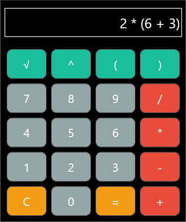

# Calculadora

## Descripció

Aquest projecte és una **calculadora bàsica** desenvolupada en **WPF (Windows Presentation Foundation)** per a realitzar operacions matemàtiques senzilles com sumes, restes, multiplicacions i divisions. La calculadora inclou un disseny intuïtiu i funcional, amb gestió d'errors i operacions encadenades, a més d'una interfície neta i fàcil d'usar.

---

## 📑 Índex

1. [Requisits del Sistema](#requisits-del-sistema)
2. [Funcionalitats Principals](#funcionalitats-principals)
3. [Guia d'Instal·lació](#guia-dinstal·lació)
4. [Guia d'Ús](#guia-dús)
5. [Exemples d'Ús i Captures de Pantalla](#exemples-dús-i-captures-de-pantalla)
6. [Conclusió](#conclusió)
7. [Llicència i Autoria](#llicència-i-autoria)

---

## ⚙️ Requisits del Sistema

Per executar aquest projecte, cal tenir el següent:

- **Visual Studio** amb suport per a desenvolupament WPF (Windows Presentation Foundation).
- **.NET Framework 4.7.2** o superior.
- **Sistema Operatiu:** Windows 10 o superior.

---

## 🔧 Funcionalitats Principals

- **Operacions bàsiques:** Suma, resta, multiplicació i divisió.
- **Operacions encadenades:** Pots realitzar diverses operacions de manera contínua.
- **Gestió d'errors:** Gestió de casos com entrades incorrectes (p. ex., "5 + =") i divisió per zero.
- **Interfície intuïtiva:** Un disseny clar amb botons arrodonits i colors diferenciats per facilitar l'ús.

---

## 📝 Guia d'Instal·lació

1. **Clonar el repositori:**

    ```bash
    git clone https://github.com/JoelMargenet/Calculadora.git
    ```

2. **Obrir el projecte a Visual Studio:**

   - Obre `Calculadora.sln` amb Visual Studio.

3. **Construir i executar el projecte:**

   - Clica a **Start** per construir i executar l'aplicació.

---

## 💡 Guia d'Ús

### 1. **Introduir números**
   - Fes clic als botons numèrics (0-9) per afegir números a l'operació.

### 2. **Afegir operadors**
   - Fes clic als botons de l'operador (p. ex., `+`, `-`, `*`, `/`) per afegir operadors a l'operació.

### 3. **Calcular el resultat**
   - Fes clic al botó `=` per calcular el resultat de l'operació actual.

### 4. **Esborrar l'operació**
   - Fes clic al botó `C` per esborrar l'operació i reiniciar la calculadora.

---

## 📸 Exemples d'Ús i Captures de Pantalla

### Pantalla inicial


### Realitzant una operació



### Resultat de l'operació


---

## 📝 Conclusions

Aquest projecte és una **calculadora funcional i senzilla** dissenyada per ser fàcil d'usar i accessible. A través d'aquest projecte, he après a treballar amb WPF i a dissenyar una interfície d'usuari intuïtiva. A més, he implementat **gestió d'errors** per millorar l'experiència de l'usuari i evitar errors en operacions incorrectes. Els passos següents podrien incloure l'ampliació de la funcionalitat per suportar operacions més complexes o la millora de la interfície amb animacions o efectes visuals.

---

## 📜 Llicència i Autoria

- **Autoria:** [Joel Margenet](https://github.com/JoelMargenet)
- **Llicència:** Aquest projecte està llicenciat sota la **Llicència MIT**. Consulta el fitxer [LICENSE](LICENSE) per a més detalls.

